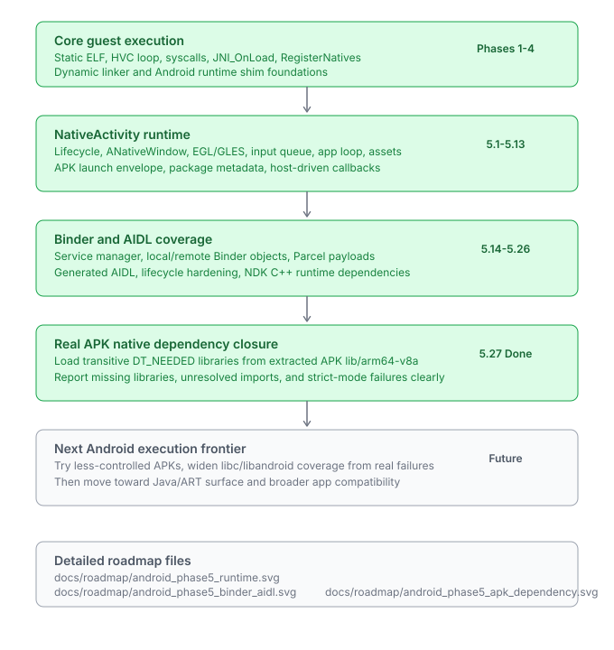

# Mular

**Mular** is a next-generation native execution layer for macOS that enables running applications from other platforms (Android, Windows) **without traditional virtualization or emulation**.

It focuses on **direct execution, system bridging, and composited rendering**, providing a lightweight and high-performance alternative to conventional approaches.

---

## 🚀 Vision

Mular aims to become a unified runtime layer where:

- Android apps run as native macOS windows
- Windows applications integrate seamlessly into macOS
- Multiple platform runtimes coexist under a single system layer
- No full OS virtualization is required

---

## ✨ Key Features (Planned)

- ⚡ **Native execution approach** (no heavy VM)
- 🧩 **Multi-runtime support**
  - Android (ART / Java layer)
  - Windows (Win32 / compatibility layer)
- 🖼 **Custom compositor**
  - Unified rendering pipeline for all platforms
- 🔗 **System bridge layer**
  - Translates platform APIs → macOS (Darwin)
- 📦 **App lifecycle management**
- 🛠 **CLI tooling (`mup`)**

---

## 🛠 Dependencies

Muplar currently depends on the following tools and libraries:

| Dependency | Purpose |
|---|---|
| Android NDK | Provides Clang toolchain, linker, and Android system headers/libraries |
| aarch64-elf-binutils | ELF inspection and binary utilities (`readelf`, `objdump`, etc.) |
| CMake | Cross-platform build system |
| Ninja | Fast build backend used by CMake |
| Apple Hypervisor Framework | Native virtualization support on macOS |
| Xcode Command Line Tools | macOS compiler and development utilities |

---

### macOS Installation

#### Install Xcode Command Line Tools

```bash
xcode-select --install
```

### Install Homebrew Dependencies
```bash
brew install android-ndk cmake ninja aarch64-elf-binutils
```
Then export the environment variable:
``` bash
export ANDROID_NDK_HOME=/opt/homebrew/share/android-ndk
```
---

## 🏗 Architecture Overview


## 🏗 Android Progress


Visual summaries:

- [Android runtime summary](./docs/roadmap/android_phase5_runtime.svg)
- [Binder and AIDL summary](./docs/roadmap/android_phase5_binder_aidl.svg)
- [APK dependency summary](./docs/roadmap/android_phase5_apk_dependency.svg)

Stable checklists:

- [Runtime](./docs/roadmap/android/runtime.md)
- [Binder and AIDL](./docs/roadmap/android/binder-aidl.md)
- [APK dependencies](./docs/roadmap/android/apk-dependencies.md)
- [Compatibility scanning](./docs/roadmap/android/compatibility-scanning.md)
- [Java and ART surface](./docs/roadmap/android/java-art-surface.md)

APK compatibility checks can use `mup --strict-direct-imports --sysroot build/sysroot app.apk`
to fail before launch when a direct native import is still unsupported.  Omit the flag for
exploratory runs that install trap stubs and report only if the guest actually calls one.

Muplar also supports Wine-style prefix metadata for isolated Android
environments. A prefix owns its package cache, runtime selection metadata, and a
reserved `rootfs/` tree while the shared Android runtime still comes from
`--sysroot`:

```bash
build/bin/mup prefix create default --kind android --arch aarch64 --sysroot build/sysroot
build/bin/mup prefix create android-ext --root ~/Muplar/android-ext --kind android --arch aarch64 --sysroot build/sysroot
build/bin/mup prefix list
build/bin/mup prefix info default
build/bin/mup prefix clone default android-test
build/bin/mup prefix clone default android-external --root ~/Muplar/android-external
build/bin/mup prefix delete android-test --yes
build/bin/mup --prefix default --sysroot build/sysroot path/to/app.apk
```

On macOS, the native desktop manager is available as an AppKit bundle:

```bash
tools/run-instance-manager.sh
```

When `--prefix` is set, APK extraction caches are written under the prefix and
`prefix.toml` records the intended runtime tuple. The visible instance list is
managed by `~/.muplar/instances.json`, so prefixes can live outside
`~/.muplar/prefixes` and arbitrary folders are not treated as instances. Prefix
metadata is generic:
Android currently runs as `kind=android`, `arch=aarch64`, `runner=elfuse`, while
future Linux and Wine prefixes can use `arch=aarch64` or `arch=x86_64` with
their own Muplar-side runtime policies. The desktop manager currently shows
instances as stopped until a long-lived `muplard` session layer owns real app
lifetime. The elfuse third-party runner remains prefix-agnostic.

For batch APK triage, use:

```bash
tools/run-apk-compat-scan.sh path/to/app.apk
```

The scan runs strict native import checks, writes logs under `build/apk-compat-scan/`,
summarizes missing APK-local libraries plus unresolved direct imports, and writes a
Markdown backlog report to `build/apk-compat-scan/report.md`.  Use `--report PATH`
to choose another report path.

The NDK AIDL fixture is expected to pass this strict scan; it covers the current
libc++/stdio/pthread diagnostic stub surface used by generated NDK code.
