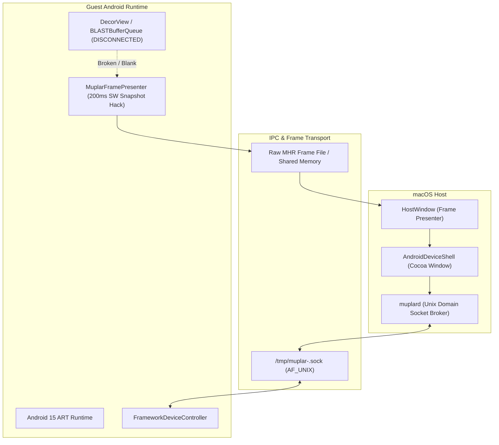

# Android Device Window

Goal: Provide a persistent, interactive Android device window on macOS with navigation controls, Launcher3 as Home, and apps opening in tabs.

---

## 1. Ground Truth Architecture & Status

`AndroidDeviceShell.mm` provides a native Cocoa/AppKit tabbed phone window, but **the underlying display and touch pipelines are currently broken**:

---

## 2. Step-by-Step Implementation Status

### Step 1: Device Window Shell
- **Status**: ✅ **Implemented**.
- `AndroidDeviceShell` provides a dedicated phone-frame window with a toolbar (Back, Home, Recents, Install APK, Settings) and embedded content viewport.

### Step 2: Session Ownership & Process Lifecycle
- **Status**: 🟡 **Partially Implemented / Hardened**.
- `PrefixManagerApp.mm` owns the `mup` task per prefix.
- Hardened process shutdown with a 500ms `kill(pid, SIGKILL)` fallback when toggling "Running" or closing the window, preventing orphaned processes.
- *Remaining issue*: Looper hangs triggered by guest callbacks (e.g. Back button) can still wedge running sessions before shutdown.

### Step 3: Route App Launches Into Tabs
- **Status**: 🟡 **Partially Implemented**.
- `AndroidDeviceShell` owns a host-managed tab strip with a permanent `Launcher` tab.
- App tab focus sends package and Activity metadata to `FrameworkDeviceController`.
- *Remaining issue*: Full Android task/back-stack modeling is host-simulated; inter-app `startActivity` and real `ActivityRecord` lifecycles are not backed by ActivityManager.

### Step 4: Navigation Controls (Back, Home, Recents)
- **Status**: 🟡 **Partially Implemented**.
- Toolbar actions flow through `DeviceAction` opcodes via `muplard` to `FrameworkDeviceController`.
- *Remaining blocker*: Pressing Back on Launcher3 causes an unhandled looper hang, locking the session.

### Step 5: Rendering & Display Pipeline
- **Status**: 🔴 **BROKEN (NOT Working)**.
- **Current reality**: Real `BLASTBufferQueue` and HWUI surface presentation do not connect to the macOS host.
- **The Hack**: `MuplarFramePresenter` uses a 200ms software polling timer calling `decor.draw(canvas)` into a software Bitmap, writing raw bytes to an MHR file.
- **Failure modes**:
  - Frequently delivers completely black, blank, or frozen frames to `HostWindow`.
  - Stale DecorView references mean active app tabs often show the launcher or a black screen.
  - Zero hardware acceleration; high CPU overhead.

### Step 6: Touch Input Routing
- **Status**: 🔴 **BROKEN (NOT Working)**.
- **Current reality**: Mouse clicks and pointer events in `AndroidDeviceShell` send `DeviceInput` opcodes via `muplard`.
- **Failure modes**:
  - Events fail to trigger view clicks or visual feedback in Launcher3 and third-party apps.
  - Coordinate translation between macOS window points and Android display resolution is unverified.
  - Scrolling, flings, and gestures are completely non-functional.

---

## 3. Engineering Priorities to Fix the Device Window

1. **Fix `MuplarFramePresenter` Output (P0)**:
   - Audit `MuplarFramePresenter.java` and `muplar_android_art_shim.c`.
   - Ensure `decor.draw()` captures real UI pixels and writes non-empty frames to the MHR pipe.
   - Eliminate black/blank frames on app launch and tab focus.
2. **Fix Touch Event Dispatch (P0)**:
   - Trace mouse click from `AndroidDeviceShell.mm` -> `muplard` -> `FrameworkDeviceController.readInputs()` -> `decor.dispatchTouchEvent()`.
   - Ensure pointer coordinates accurately map to view bounds.
   - Verify clicks produce visible button presses and icon launches.
3. **Fix Back-Button Session Hang (P1)**:
   - Ensure `FrameworkDeviceController.performBack()` never enters an infinite looper wait.
4. **Long-Term Hardware Surface (P2)**:
   - Replace the software bitmap MHR file with a direct ANGLE / Metal surface swapchain.
