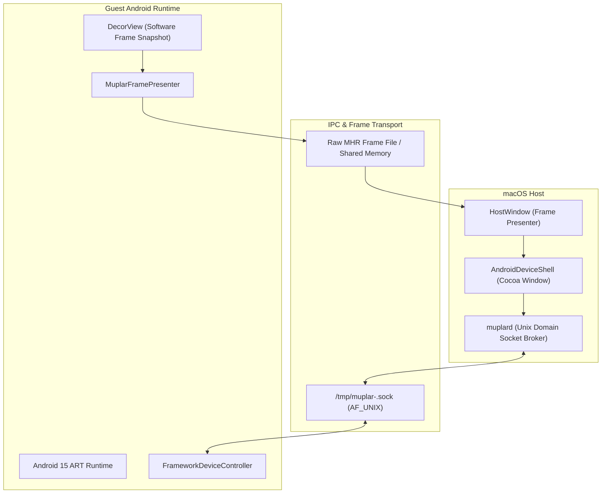

# Android Device Window

Goal: Provide a persistent, interactive Android device window on macOS with navigation controls, Launcher3 as Home, and apps opening in tabs.

---

## 1. Ground Truth Architecture & Status

`AndroidDeviceShell.mm` provides a native Cocoa/AppKit tabbed phone window with active display, input, and lifecycle integration:

```mermaid
graph TD
    subgraph Host ["macOS Host"]
        Shell["AndroidDeviceShell (Cocoa Window)"]
        HW["HostWindow (Frame Presenter)"]
        Daemon["muplard (Unix Domain Socket Broker)"]
    end

    subgraph Bridge ["IPC & Frame Transport"]
        Sock["/tmp/muplar-<prefix>.sock (AF_UNIX)"]
        MHR["Raw MHR Frame File / Shared Memory"]
    end

    subgraph Guest ["Guest Android Runtime"]
        ART["Android 15 ART Runtime"]
        Controller["FrameworkDeviceController"]
        Decor["DecorView (Software Frame Snapshot)"]
        Presenter["MuplarFramePresenter"]
    end

    Shell --> Daemon
    Daemon <--> Sock <--> Controller
    Decor --> Presenter
    Presenter --> MHR --> HW --> Shell
```

---

## 2. Step-by-Step Implementation Status

### Step 1: Device Window Shell
- **Status**: ✅ **Implemented**.
- `AndroidDeviceShell` provides a dedicated phone-frame window with a toolbar (Back, Home, Recents, Install APK, Settings) and embedded content viewport.

### Step 2: Session Ownership & Process Lifecycle
- **Status**: 🟢 **Implemented / Hardened**.
- `PrefixManagerApp.mm` owns the `mup` task per prefix.
- Hardened process shutdown with a 500ms `kill(pid, SIGKILL)` fallback when toggling "Running" or closing the window, preventing orphaned processes.

### Step 3: Route App Launches Into Tabs
- **Status**: 🟢 **Implemented & Verified**.
- `AndroidDeviceShell` owns a host-managed tab strip with a permanent `Launcher` tab.
- App tab focus sends package and Activity metadata to `FrameworkDeviceController`.
- Multi-activity task back-stack navigation verified end-to-end (`test-backstack.sh`).
- In-session APK installation dynamically refreshes Launcher3 app list and opens new app tabs (`test-install-ux.sh`).

### Step 4: Navigation Controls (Back, Home, Recents)
- **Status**: 🟢 **Implemented & Verified**.
- Toolbar actions flow through `DeviceAction` opcodes via `muplard` to `FrameworkDeviceController`.
- State-aware `performBack()` on `QuickstepLauncher` prevents infinite looper deadlocks and resumes parent tasks cleanly (`test-backstack.sh`).

### Step 5: Rendering & Display Pipeline
- **Status**: 🟢 **Functional (Software DecorView Snapshot)** / 🟡 **Hardware Acceleration (P2)**.
- **Current reality**: Event-driven software DecorView presentation via `MuplarFramePresenter` reliably presents 1080x1920 frames to `HostWindow` (`visual-smoke.sh`, `test-framework-rendering.sh`).
- **Next milestone**: Direct hardware acceleration via ANGLE/Metal backing `BLASTBufferQueue` to eliminate software bitmap copying.

### Step 6: Touch Input & Scroll Routing
- **Status**: 🟢 **Working (Clicks, Touches & Trackpad/Mouse Scrolling)**.
- **Current reality**: Pointer events translated from `AndroidDeviceShell.mm` through `muplard` dispatch into `dispatchTouchEvent()`, triggering icon launches, button clicks, and gesture transitions (`test-touch-interaction.sh`, `test-click-icon.sh`, `test-launcher-drag.sh`).
- `scrollWheel:` event mapping in `AndroidDeviceFrameView` translates macOS trackpad phases and mouse wheel deltas into smooth Android pointer drag sequences for natural list and view scrolling.

### Step 7: Keyboard & Text Input (Typing & IME)
- **Status**: 🟢 **Implemented & Verified**.
- **Current reality**: `AndroidDeviceShell.mm` extracts macOS modifier flags (`metaState`) and Unicode codepoints from `NSEvent` key events and delivers them via `muplard` opcode 27.
- `FrameworkDeviceController` reconstructs 10-argument `KeyEvent`s and dispatches them through decor view down to the active focus view.
- `EditText` implements complete keyboard typing, backspace/del, home/end, DPAD cursor positioning, shifted symbols, and Unicode character insertion (`test-keyboard-input.sh`).
- Proxy handling in `MuplarServices` for `IActivityClientController` and `IActivityTaskManager` ensures activity-level lifecycle actions (e.g. `finish()`) properly interact with the task stack.

---

## 3. Engineering Priorities for the Device Window

1. **Hardware Surface Pipeline via ANGLE / Metal (P1)**:
   - Replace the software bitmap MHR file with a direct ANGLE / Metal surface swapchain.
2. **macOS Notification Forwarding (P2)**:
   - Surface Android notification toasts and channels into native macOS notification banners.
3. **Clipboard & Drag-and-Drop Sync (P2)**:
   - Bi-directional clipboard text synchronization between macOS pasteboard and Android `ClipboardManager`.
   - Bridge Android `NotificationManager` alerts to macOS `UNUserNotificationCenter`.
